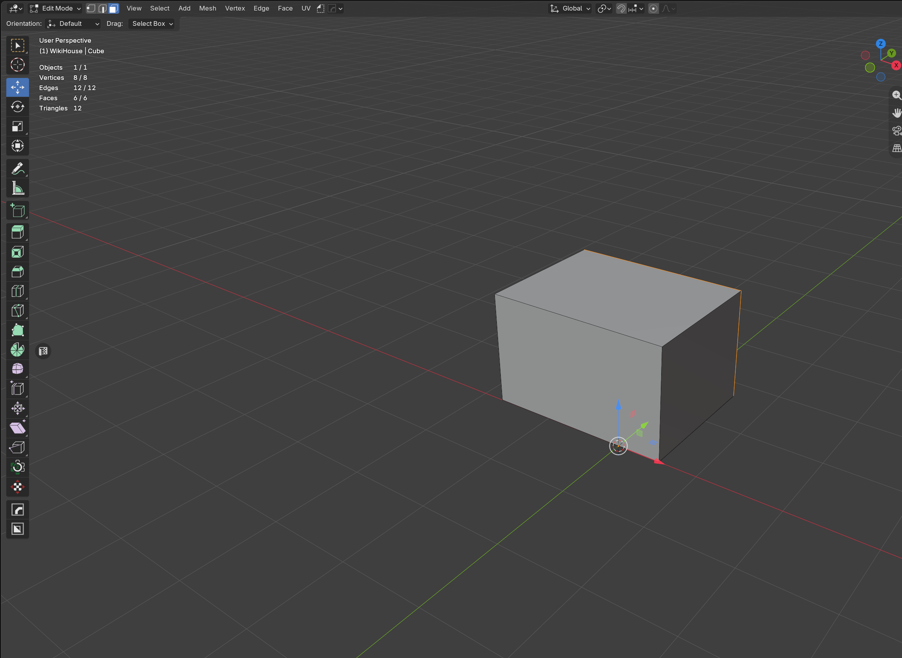
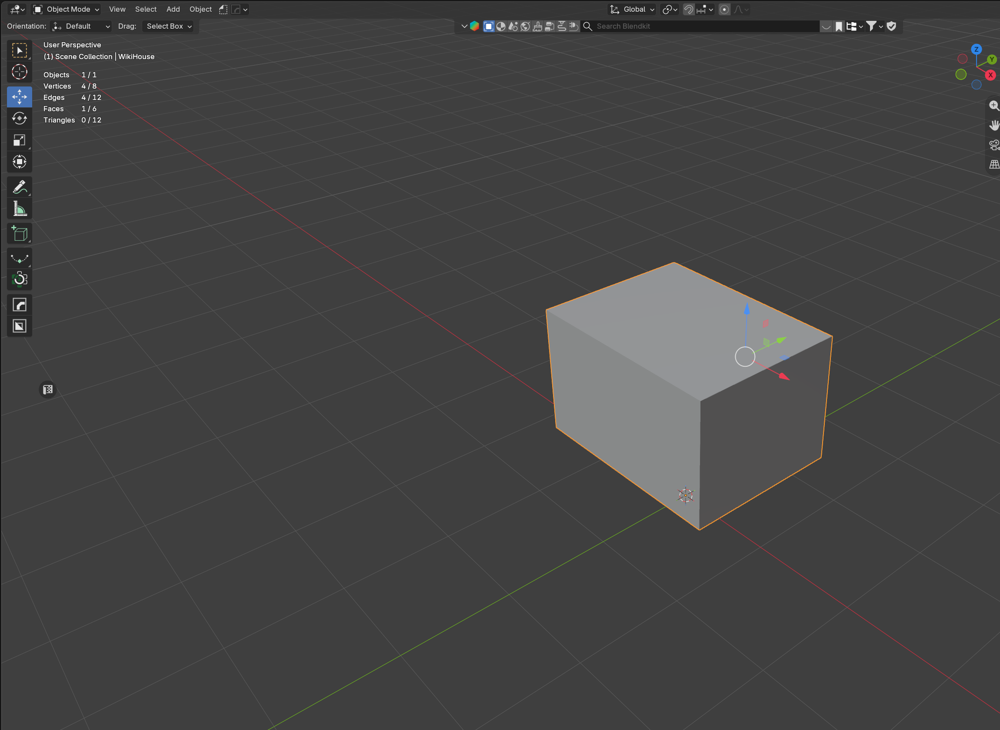

# Faces → AABB

Enge **achsparallele Box** um die gewählten Faces. Dicke = Mesh-Span plus **1 mm je Seite** (keine 15-cm-Wandplatte).

## Ablauf

1. Resolution-Mesh aktivieren, **Tab** → Edit Mode, Face-Select
2. Die Wand-/Boden-/Dachflächen markieren (eine oder mehrere)
3. N-Panel → **Faces → AABB**
4. In der Collection `GEO_Components` liegt `Component01`, `Component02`, …

Die Box sitzt 1 mm über den Faces. Face-Normalen zeigen **nach außen** (DayZ Geometry LOD).

Danach: weitere Wände ebenso, dann [Merge → Geometry LOD](Merge-Geometry-LOD.md).

## Wann Hull statt AABB?

AABB ist achsparallel — bei schrägen Dächern oder gedrehten Wänden besser **[Verts → Hull](Verts-Hull.md)**.
