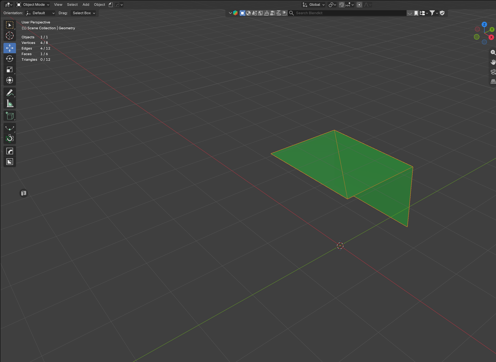

# Merge → Geometry LOD

Führt alle Objekte aus `GEO_Components` zu **einem** Mesh `Geometry` zusammen. Jede Component bleibt eine Vertex Group `Component01`, `Component02`, …

## Ablauf

1. Components mit AABB / Hull / Decompose erzeugen
2. **Merge → Geometry LOD** (Exact — kein extra Convex Hull)
3. Objekt `Geometry` in der Collection `Geometry`
4. **Tag as Geo LOD** falls noch nicht gesetzt
5. **DayZ Check**

## Exact vs Hull-Merge

- **Merge Exact** — Boxen und manuelle Components so lassen, wie sie sind (Gebäude)
- **Merge Hull** — nochmal Convex Hull pro Component (V-HACD / CoACD / organische Props)

DayZ: höchstens **32** Components, **255** Vertices pro Component. Siehe [DayZ-Regeln](DayZ-Regeln.md).
