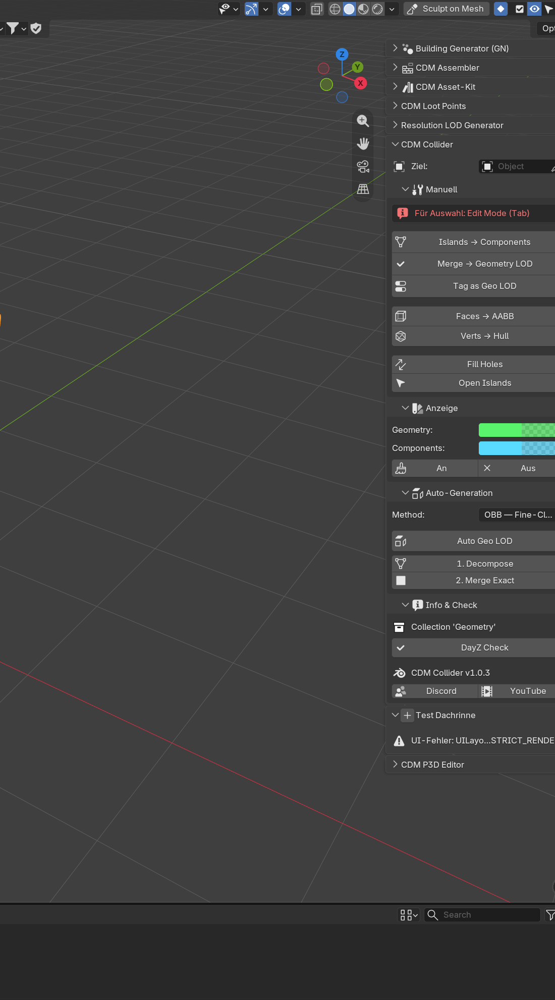

# CDM Collider

Blender-Addon für **DayZ Collision / Geometry LOD**.

Eigenständiges Addon — nicht die alte DayZ-Suite. Passt zu [CDM Architect](https://github.com/Crash357) und CDM P3D Studio.

## Schnellstart

1. [Installation](Installation.md) — ZIP aus dem Release, Blender 4.2+
2. N-Panel **CDM** → Abschnitt **CDM Collider**
3. Edit Mode → Faces oder Verts wählen
4. **Faces → AABB** oder **Verts → Hull**
5. **Merge → Geometry LOD**
6. **DayZ Check** (max. 32 Components, 255 Verts)

## Handbuch

- [N-Panel](N-Panel.md) — alle Buttons
- [Faces → AABB](Faces-AABB.md) — enge Box, 1 mm Skin
- [Verts → Hull](Verts-Hull.md) — Convex Hull, 1 mm Skin
- [Merge → Geometry LOD](Merge-Geometry-LOD.md)
- [V-HACD und CoACD](VHACD-und-CoACD.md)
- [DayZ-Regeln](DayZ-Regeln.md) — Normalen, Limits, Shading

## Download

[Release 1.0.3](https://github.com/Crash357/CDM_Collider/releases/tag/v1.0.3) · [Discord](https://discord.gg/9PM8BjWmp8) · [YouTube](https://www.youtube.com/@crash_dayz_modding)
