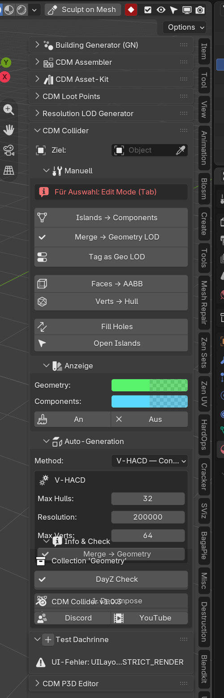
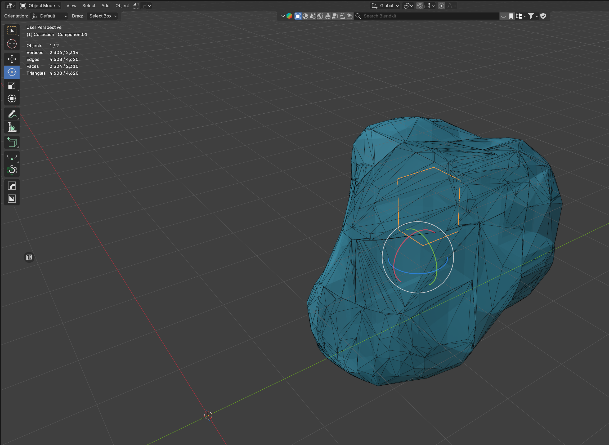
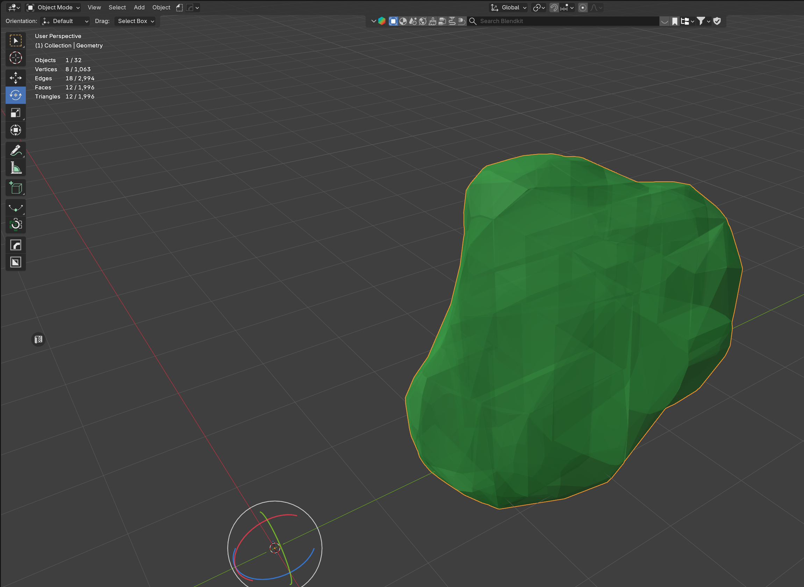

# V-HACD und CoACD

Automatische Zerlegung unregelmäßiger Meshes in Convex Hulls. Beispiel: **Rock**.

Für Gebäudewände und den Cube zuerst [Faces → AABB](Faces-AABB.md) / [Verts → Hull](Verts-Hull.md) nutzen.

## V-HACD (Rock)

1. Rock aktivieren (Object Mode)
2. Auto-Generation: Methode **VHACD**
3. DayZ-tauglich: Max Hulls **32**, Max Verts **255** (im Beispiel: 64 Verts, 200 000 Resolution)

4. **1. Decompose** — braucht `TestVHACD.exe` (liegt in der ZIP)
5. Cyan: einzelne Hulls in `GEO_Components` (`Component01` …)

6. **2. Merge Hull** → grünes `Geometry`-LOD

Pfad zur EXE: Preferences → CDM Collider → TestVHACD.exe

Wenn **Merge → Geometry Collection** an ist, kann das Merge direkt nach Decompose laufen. Components bleiben zum Prüfen in `GEO_Components`.

## CoACD

1. Methode **CoACD**
2. **DayZ Preset** anlassen (32 Hulls, sinnvolle Defaults)
3. **Decompose**, dann **Merge Hull**

CoACD kommt als Wheel in der ZIP (`bundled/`). Beim ersten Lauf installiert das Addon die Abhängigkeit bei Bedarf.
