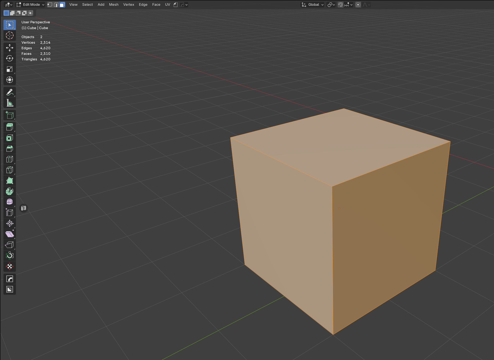
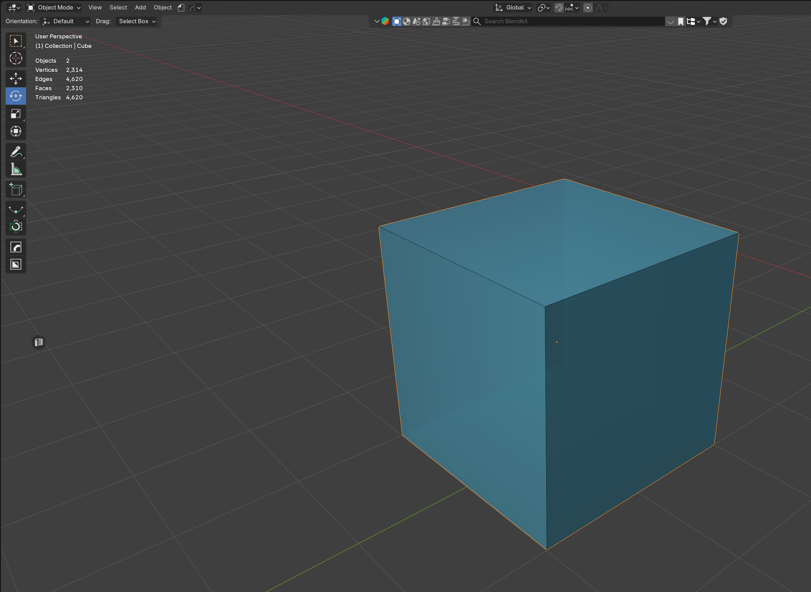

# Faces → AABB

Tight **axis-aligned box** around the selected faces. Thickness = mesh span plus **1 mm per side** (not a 15 cm wall slab).

Example: **Cube** in the prepared scene.

## Steps

1. Activate the Cube, **Tab** → Edit Mode, face select
2. Select the faces (here: all six faces of the Cube)

3. N-panel → **Faces → AABB**
4. `Component01` appears in collection `GEO_Components` (cyan)

The box sits 1 mm outside the faces. Face normals point **outward** (DayZ Geometry LOD).

Next: [Merge → Geometry LOD](Merge-Geometry-LOD.md).

## When to use Hull instead

AABB is axis-aligned — for slanted roofs or rotated walls prefer **[Verts → Hull](Verts-Hull.md)**. Irregular props (rocks): **[V-HACD](VHACD-and-CoACD.md)**.
