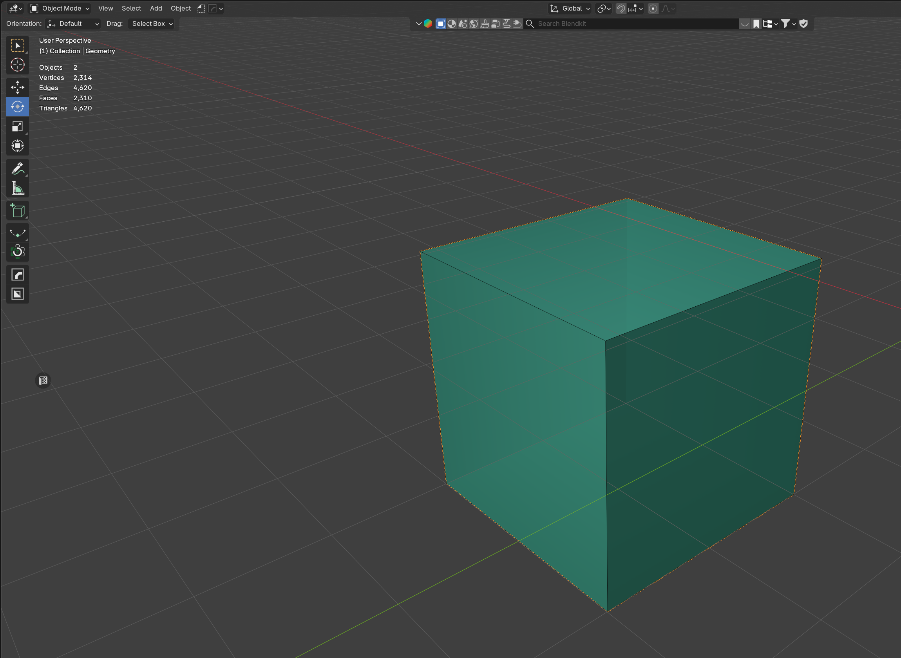

# Merge → Geometry LOD

Merges every object in `GEO_Components` into **one** mesh named `Geometry`. Each component stays a vertex group `Component01`, `Component02`, …

Cube example after Faces → AABB and **Merge Exact**:

Green = Geometry LOD. Cyan = individual components.

## Steps

1. Create components with AABB / Hull / Decompose
2. **Merge → Geometry LOD** (Exact — no extra convex hull) or **2. Merge Hull** for V-HACD
3. Object `Geometry` in collection `Geometry`
4. **Tag as Geo LOD** if not already set
5. **DayZ Check**

## Exact vs hull merge

- **Merge Exact** — keep boxes and manual components as they are (Cube, building walls)
- **Merge Hull** — convex hull again per component (V-HACD / CoACD / organic props)

DayZ: at most **32** components, **255** vertices per component. See [DayZ rules](DayZ-Rules.md).
