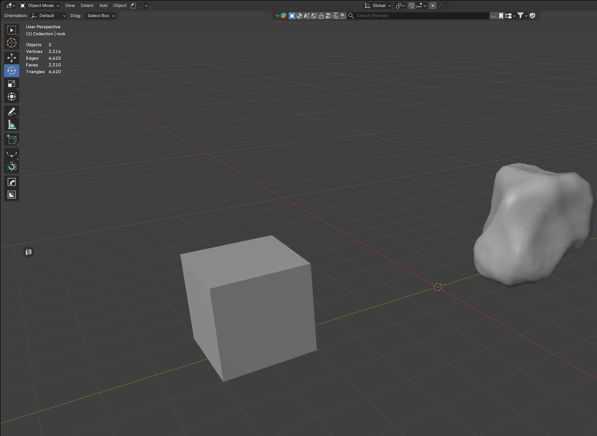

# CDM Collider

Blender add-on for **DayZ collision / Geometry LOD**.

Standalone add-on — not the old DayZ Suite. Pairs with CDM Architect and CDM P3D Studio.

Example scene in this handbook: **Cube** (normal collision, Faces → AABB) and **Rock** (convex hull, V-HACD).

Screenshots were taken in Blender; the N-panel labels may appear in German.

## Quick start

1. [Installation](Installation.md) — ZIP from the release, Blender 4.2+
2. N-panel **CDM** → section **CDM Collider**
3. Cube: Edit Mode → select faces → **Faces → AABB** → **Merge → Geometry LOD**
4. Rock: method **V-HACD** → **1. Decompose** → **2. Merge Hull**
5. **DayZ Check** (max. 32 components, 255 verts)

## Handbook

- [N-panel](N-Panel.md) — every button
- [Faces → AABB](Faces-AABB.md) — Cube, tight box, 1 mm skin
- [Verts → Hull](Verts-Hull.md) — convex hull, 1 mm skin
- [Merge → Geometry LOD](Merge-Geometry-LOD.md)
- [V-HACD and CoACD](VHACD-and-CoACD.md) — Rock
- [DayZ rules](DayZ-Rules.md) — normals, limits, shading, beta test

[Deutsch](../de/README.md)

## Download

[Release 1.0.3](https://github.com/Crash357/CDM_Collider/releases/tag/v1.0.3) · [Discord](https://discord.gg/9PM8BjWmp8) · [YouTube](https://www.youtube.com/@crash_dayz_modding) · [Donate (PayPal)](https://paypal.me/crash12345?country.x=DE&locale.x=de_DE)
